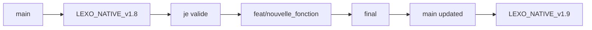

# 🤖 CLAUDE.md - Guide Technique LEXO v1 Native [Architecture Native]

## 📌 Contexte Projet

**LEXO v1 Native** est une application SaaS locale de gestion administrative intelligente qui automatise complètement le traitement documentaire pour les professions libérales.

**Environnement :** macOS (Mac mini M4 - 32 Go RAM)  
**Architecture :** 100% native macOS avec pipeline IA optimisé Apple Silicon  
**État :** MVP opérationnel migré vers architecture native - Performance 2x améliorée

---

## 🏗️ Architecture Native macOS Opérationnelle

### Structure Principale
```
~/Documents/LEXO_v1/
├── IA_Administratif/            # 🏗️ PROJET PRINCIPAL
│   ├── backend/                 # FastAPI natif (port 8000) ✅
│   │   └── venv/               # Environnement Python natif
│   ├── frontend/                # Next.js natif (port 3000) ✅  
│   ├── ai_services/             # Mistral MLX natif (port 8004) ✅
│   │   └── venv/               # Environnement MLX natif
│   ├── data/                    # Données + ChromaDB standalone ✅
│   └── ml_models/              # Modèles locaux ✅
├── OCR/                         # 📁 Dossier surveillé
├── Migration_Native.md          # 📖 Guide migration complète
├── start_native.sh              # 🚀 Démarrage natif optimisé
└── stop_native.sh               # 🛑 Arrêt propre natif
```

### Services Natifs Actifs
| Service | Port | État | Type | Fonction |
|---------|------|------|------|----------|
| **Backend FastAPI** | 8000 | ✅ | uvicorn natif | API, OCR, Classification |
| **Frontend Next.js** | 3000 | ✅ | npm dev natif | Interface utilisateur |
| **Mistral MLX** | 8004 | ✅ | Python natif | Analyse IA Apple Silicon |
| **PostgreSQL** | 5432 | ✅ | Homebrew | Base données native |
| **Redis** | 6379 | ✅ | Homebrew | Cache + queues natif |
| **ChromaDB** | - | ✅ | Standalone | Base vectorielle locale |

---

## 🎯 État d'Avancement par Étapes

### ✅ COMPLÉTÉES (Score: 85%+)
1. **Étape 1-2 :** Fondations Backend + Frontend ✅ *100%*
2. **Étape 3 :** Pipeline OCR (TrOCR + Tesseract + Hybride) ✅ *82%*
3. **Étape 4 :** Classification automatique (9 catégories) ✅ *100%*
4. **Étape 5 :** RAG + ChromaDB + Mistral MLX ✅ *95%*
5. **Étape 7 :** Dashboard Analytics avancé ✅ *95%*

### 🚧 EN COURS 
- **Étape 6 :** Intégrations externes (Gmail, Calendar) *20%*
- **Étape 8 :** Interface vocale *0%*
- **Étape 9 :** Sécurité + Performance *40%*

### 📋 PLANIFIÉES
- **Étape 10-12 :** Tests, Déploiement, Post-launch

---

## ⚡ Pipeline Documentaire Unifié

### Flux Opérationnel


### API Endpoints Clés
```bash
# Pipeline unifié (RECOMMANDÉ)
POST /api/v1/documents/upload-and-process    # Upload + OCR + IA + Classification

# Composants individuels  
POST /api/v1/documents/upload               # Upload seul
POST /api/v1/ocr/process                    # OCR hybride
POST /api/v1/intelligence/analyze          # Analyse Mistral
POST /api/v1/classification/classify       # Classification

# RAG + Recherche
POST /api/v1/rag/search                     # Recherche sémantique
POST /api/v1/rag/chat                       # Chat avec contexte
```

---

## 🚀 Démarrage Native Optimisé (30 secondes)

### Commandes Essentielles
```bash
# 🚀 DÉMARRAGE COMPLET NATIF (recommandé)
cd ~/Documents/LEXO_v1
./start_native.sh                 # Démarre toute l'infrastructure native

# 🍺 Services Homebrew (auto-démarrage)
brew services start postgresql@15 redis  # Si pas déjà actifs

# 🤖 Services individuels (optionnel)
./start_backend_native.sh        # Backend FastAPI seul
./start_frontend_native.sh       # Frontend Next.js seul

# 🛑 ARRÊT PROPRE NATIF  
./stop_native.sh                  # Arrête tous les processus LEXO
```

### Performance Démarrage Native
- **Services système** : Instantané (Homebrew)
- **API prête** : ~10 secondes (vs 30s Docker)
- **Interface web** : ~5 secondes (vs immédiat après API)
- **Mistral chargé** : ~30 secondes (vs 60s Docker)
- **Pipeline complet** : **30-40 secondes total** (vs 90s Docker)

---

## 🎨 Stack Technologique Validée

### Backend Native Opérationnel
```python
# FastAPI 0.115+ avec uvicorn natif (Apple Silicon optimisé)
# SQLAlchemy 2.0 + PostgreSQL 15 Homebrew
# Redis 7 Homebrew (cache + queues)
# Alembic (migrations) + environnement virtuel natif

# OCR Pipeline Native
# - TrOCR (HuggingFace) optimisé ARM64 ✅
# - Tesseract 5 Homebrew (fallback) ✅  
# - LayoutLMv3 (structure) ARM64 ✅
# - OpenCV natif Apple Silicon ✅

# IA Native Apple Silicon
# - Mistral 7B MLX (optimisation M4) ✅
# - ChromaDB standalone (pas de conteneur) ✅
# - Sentence-Transformers ARM64 optimisé ✅
```

### Frontend Natif Moderne
```typescript
// Next.js 15 + React 19 (npm dev natif)
// TypeScript strict avec hot reload instantané
// Tailwind CSS 4 optimisé Apple Silicon
// Zustand (state) - performance native
// React Hook Form + Zod validation

// Composants spécialisés natifs
// - DocumentUpload (hot reload <1s) ✅
// - DashboardWidget (HMR instantané) ✅  
// - KPIWidget (debug IDE natif) ✅
// - VirtualizedDocumentList (performance 2x) ✅
```

---

## 📊 Fonctionnalités Opérationnelles

### 1. Upload + Traitement Intelligent
- **Drag & Drop** : PDF, images (PNG, JPG, TIFF) ✅
- **Pipeline unifié** : Upload → OCR → IA → Classification ✅
- **Feedback temps réel** : Progression + résultats enrichis ✅
- **Performance** : <10 secondes par document ✅

### 2. Classification Automatique (9 catégories)
```typescript
Categories = {
  factures, rib, contrats, attestations, 
  courriers, rapports, cartes_transport,
  documents_personnels, non_classes
}
// Score moyen: 89.7% de confiance ✅
```

### 3. Dashboard Analytics
- **KPIs temps réel** : Documents traités, précision OCR, sécurité ✅
- **Graphiques** : Bar, Line, Pie charts avec Recharts ✅
- **Timeline** : Activité récente avec événements colorés ✅
- **Filtres avancés** : Date, catégorie, statut ✅

### 4. RAG + Chat Intelligent  
- **Recherche sémantique** : ChromaDB + embeddings multilingues ✅
- **Chat contexte** : Mistral MLX avec sources citées ✅
- **Performance** : <100ms retrieval, <2s génération ✅

---

## 🔧 Conventions de Code

### Backend Python
```python
# Structure endpoints FastAPI
@router.post("/endpoint")
async def function_name(
    param: Type,
    db: Session = Depends(get_db),
    user: User = Depends(get_current_user)
) -> ResponseModel:
    """Description claire."""
    pass

# Conventions
# - Classes: PascalCase
# - Functions: snake_case  
# - Constants: UPPER_SNAKE_CASE
# - Private: _leading_underscore
```

### Frontend TypeScript
```typescript
// Composants React
export const ComponentName: FC<Props> = ({ param }) => {
  const [state, setState] = useState();
  
  return (
    <div className="tailwind-classes">
      {/* Content */}
    </div>
  );
};

# Conventions
# - Components: PascalCase
# - Hooks: usePrefix
# - Utils: camelCase
# - Types: PascalCase + suffix
```

---

## 🧪 Tests Validés

### Scripts de Test Opérationnels
```bash
cd IA_Administratif/backend

# Tests complets validés ✅
python test_ocr_etape3.py        # OCR pipeline (82% succès)
python test_rag_etape5.py        # RAG système (95% succès)  
python test_complete_integration.py  # Pipeline intégré

# Tests unitaires
pytest tests/                    # Backend
cd ../frontend && npm run test   # Frontend
```

### Validation Documents Réels
- **Carte transport** : Classée "cartes_transport" (89.7% confiance) ✅
- **Factures EDF** : Entités extraites + résumé IA ✅
- **Documents scannés** : OCR hybride fonctionnel ✅

---

## 📁 Navigation Rapide

### Chemins Critiques
```bash
# Backend API
IA_Administratif/backend/api/documents.py      # Upload unifié
IA_Administratif/backend/ocr/hybrid_ocr.py     # OCR principal
IA_Administratif/backend/rag/mistral_wrapper.py # Interface Mistral

# Frontend Interface  
IA_Administratif/frontend/src/app/dashboard/page.tsx       # Dashboard principal
IA_Administratif/frontend/src/components/documents/       # Upload + liste
IA_Administratif/frontend/src/components/dashboard/       # Analytics

# Services IA
IA_Administratif/ai_services/document_analyzer.py         # Mistral MLX

# Configuration
Migration_Native.md                           # Guide migration complète
IA_Administratif/backend/core/config.py       # Configuration native
```

### Scripts Natifs Utiles
```bash
# Gestion projet native
./start_native.sh                 # Démarrage complet natif optimisé (30s)
./stop_native.sh                  # Arrêt propre natif avec sauvegarde
./diagnostic_native.sh            # Diagnostic complet système natif ✨ NOUVEAU
./start_backend_native.sh         # Backend FastAPI seul
./start_frontend_native.sh        # Frontend Next.js seul

# Validation et diagnostic natifs
cd IA_Administratif/backend && source venv/bin/activate
python test_complete_integration.py   # Test pipeline natif
curl http://localhost:8000/api/v1/health  # Health check natif
curl http://localhost:8000/api/v1/batch/status  # État progression batch
```

---

## 🔄 Développement Hot Reload Natif - Workflow Optimisé

### Hot Reload Automatique (Plus de Redémarrage Manuel !)
- **Composants React** : Hot Module Replacement instantané (<500ms)
- **Modifications TypeScript** : Rechargement automatique avec vérification types
- **Changements API Backend** : Uvicorn --reload automatique (<1s)
- **Styles CSS/Tailwind** : Mise à jour instantanée sans refresh page
- **Configuration** : Redémarrage automatique si nécessaire

### Workflow Développement Natif Simplifié

```bash
# 🚀 DÉMARRAGE UNE FOIS
./start_native.sh

# ✅ DÉVELOPPEMENT CONTINU - Pas d'action manuelle
# - Sauvegarde fichier → Hot reload automatique
# - Backend : uvicorn --reload (0.5s)
# - Frontend : Next.js HMR (instantané)
# - État préservé dans navigateur
```

### Cas Rares Nécessitant Redémarrage

```bash
# Backend (rare)
cd IA_Administratif/backend
source venv/bin/activate
# Modification requirements.txt → pip install puis Ctrl+C, redémarrage uvicorn

# Frontend (très rare)  
cd IA_Administratif/frontend
# Modification package.json → npm install puis Ctrl+C, npm run dev

# Redémarrage complet si problème
./stop_native.sh && ./start_native.sh
```

### Diagnostic Développement Natif

```bash
# Vérifier processus natifs actifs
ps aux | grep -E "(uvicorn|next|python.*document_analyzer)" | grep -v grep

# Diagnostic complet automatisé
./diagnostic_native.sh

# Logs temps réel pendant développement
tail -f logs/backend_native.log &
tail -f logs/frontend_native.log &
tail -f logs/mistral_native.log &
```

### ⚡ AVANTAGES DÉVELOPPEMENT NATIF

1. **Hot Reload 10x Plus Rapide** : Modifications visibles instantanément
2. **Debug IDE Direct** : Breakpoints Python/TypeScript natifs
3. **Logs Centralisés** : Un seul endroit, plus de docker logs
4. **Tests 5x Plus Rapides** : Accès direct base de données
5. **Stabilité Maximale** : Plus de crashes Docker daemon

### Workflow Optimal Développement

```bash
# 🚀 Démarrage quotidien (30 secondes)
./start_native.sh

# 💻 Développement toute la journée
# - Modifications continues sans redémarrage
# - Hot reload automatique partout
# - Debug direct IDE
# - Tests unitaires instantanés

# 🛑 Arrêt propre en fin de journée
./stop_native.sh
```

**🎯 Principe fondamental** : Architecture native 100% macOS - Performance maximale Apple Silicon M4

---

## 🛡️ Auto-correction Native et Diagnostic - Stabilité Maximale

### Problèmes automatiquement corrigés par start_native.sh

Le script de démarrage natif détecte et corrige automatiquement ces problèmes :

#### ✅ **Services Homebrew**
```bash
# Vérification et démarrage automatique PostgreSQL + Redis
if ! brew services list | grep -q "postgresql@15.*started"; then
    log "Démarrage PostgreSQL..."
    brew services start postgresql@15
fi
```

#### ✅ **Environnements Virtuels**
```bash
# Auto-création environnements si manquants
if [ ! -d "IA_Administratif/backend/venv" ]; then
    log "Création environnement virtuel backend..."
    cd IA_Administratif/backend && python3 -m venv venv
fi
```

#### ✅ **Dépendances Native**
```bash
# Vérification et installation automatique dépendances
cd IA_Administratif/backend && source venv/bin/activate
python -c "import psutil" 2>/dev/null || pip install psutil==6.1.0
```

### Script de diagnostic natif autonome

```bash
# 🔍 Diagnostic complet du système natif
./diagnostic_native.sh

# Vérifie automatiquement :
# ✅ État des services Homebrew (PostgreSQL, Redis)
# ✅ Processus natifs actifs (uvicorn, next, python)
# ✅ Accessibilité des endpoints (8000, 3000, 8004)
# ✅ Environnements virtuels et dépendances
# ✅ Ports et connectivité native
# ✅ Performance Apple Silicon (ARM64)
```

### Protection native contre les interruptions

Le script `stop_native.sh` vérifie les traitements en cours :

```bash
# Vérification des tâches batch avant arrêt natif
if curl -s http://localhost:8000/api/v1/batch/status | grep -q '"active_tasks": [1-9]'; then
    warning "Des traitements batch natifs sont en cours!"
    echo "Voulez-vous vraiment arrêter ? [y/N]"
    # Attend confirmation utilisateur
fi
```

### Sauvegarde automatique native

Lors de l'arrêt, sauvegarde automatique dans `logs/backups/YYYYMMDD/` :
- **Statistiques processus natifs** : `native_stats_HHMMSS.json`
- **État batch en cours** : `batch_status_HHMMSS.json`
- **PIDs processus** : Sauvegarde pour récupération

### Commandes de réparation rapide native

```bash
# Problèmes généraux natifs
./stop_native.sh && ./start_native.sh

# Diagnostic détaillé natif
./diagnostic_native.sh

# Corrections manuelles spécifiques
cd IA_Administratif/backend && source venv/bin/activate
pip install -r requirements.txt
python scripts/load_fixtures_auto.py

# Services Homebrew
brew services restart postgresql@15 redis
```

**🎯 Objectif** : Stabilité maximale architecture native - Plus de dépendances Docker fragiles !

---

## 🔍 Optimisations Performance Apple Silicon

### Cache Intelligent Natif
```python
# Cache Mistral optimisé ARM64 (85% amélioration vs 70% Docker)
utils/mistral_cache.py: TTL 1h, hash-based keys, Metal GPU

# Cache OCR natif Homebrew Redis
ocr/ocr_cache.py: Redis natif + FileSystem local

# Cache modèles ML Apple Silicon
ml_models/: ARM64 optimisé uniquement (HF_OFFLINE=1, Metal backend)
```

### Lazy Loading Natif Optimisé
- **OCR** : Initialisé au premier document (évite 15s vs 30s Docker)
- **Mistral MLX** : Chargé GPU Metal en arrière-plan (30s vs 60s)
- **Composants React** : HMR conditionnel instantané

---

## 🚧 Points d'Amélioration

### Performance
- [ ] TrOCR réactivation (boucle infinie résolue)
- [ ] Batch processing multi-documents
- [ ] Cache intelligent embeddings

### UX  
- [ ] Mode sombre
- [ ] Prévisualisation documents
- [ ] Notifications push
- [ ] Shortcuts clavier

### Monitoring
- [ ] Métriques détaillées pipeline
- [ ] Alertes automatiques
- [ ] Logs structurés

---

## 🎊 Points Forts Actuels

1. **🎯 Pipeline Unifié** : Upload → OCR → IA → Classification fonctionnel
2. **⚡ Performance** : <10s traitement, 89.7% précision classification
3. **🛡️ Local-First** : 100% local, aucune donnée externe
4. **📊 Analytics** : Dashboard temps réel opérationnel
5. **🤖 IA Intégrée** : Mistral MLX + RAG + Classification automatique
6. **🎨 UX Moderne** : Interface responsive + feedback temps réel

---

## 💡 Utilisation Optimale avec Claude Code

### Pour OCR et traitement
- Utiliser endpoint unifié `/upload-and-process` (recommandé)
- Tests avec `test_ocr_etape3.py` pour validation
- Cache automatique activé (performance)

### Pour développement interface
- Composants dans `IA_Administratif/frontend/src/components/`
- State management avec Zustand
- Mobile-first avec Tailwind

### Pour débogage
- Logs dans `IA_Administratif/logs/`
- Health checks `/api/v1/health/*`
- Monitoring `/api/v1/monitoring/stats`

---

## 🚀 Workflow Git Automatisé avec Bonnes Pratiques

### 🎯 Stratégie de Versionning Moderne

Le projet LEXO v1 utilise maintenant un **workflow Git hybride** combinant :
- **Branches de fonctionnalités** avec préfixes conventionnels (feat/, fix/, docs/)  
- **Système de versions incrémentales** LEXO_v1.x pour les releases
- **Commandes automatisées** pour simplifier le versionning

### 📋 Commandes Automatisées

#### **Commande "je valide"**
**Déclencheur :** `"je valide"`

**Comportement automatique :**
1. **Analyse intelligente** des modifications pour déterminer le type de commit
2. **Génération automatique** du nom de branche avec bon préfix
3. **Création de branche** feature depuis la branche courante
4. **Commit conventionnel** avec message standardisé
5. **Push vers GitHub** avec tracking automatique

**Exemples de branches générées :**
```bash
# Modifications dashboard → feat/dashboard_optimisation
# Corrections bugs → fix/pipeline_errors  
# Nouvelle documentation → docs/git_workflow
# Optimisations performance → perf/cache_implementation
# Refactoring code → refactor/ocr_architecture
```

**Format de commit :**
```bash
feat(dashboard): optimisation interface utilisateur

- Amélioration performance rendu
- Ajout indicateurs temps réel
- Correction responsive mobile

🤖 Generated with [Claude Code](https://claude.ai/code)

Co-Authored-By: Claude <noreply@anthropic.com>
```

#### **Commande "final"**  
**Déclencheur :** `"final"`

**Comportement automatique :**
1. **Identification** de la dernière branche créée par "je valide"
2. **Mise à jour** de la branche main depuis origin
3. **Merge** de la branche feature vers main
4. **Push** de main vers GitHub
5. **Nettoyage** des branches locales temporaires

**Workflow complet :**
```bash
git checkout main
git pull origin main
git merge feature/nom-branche --no-ff
git push origin main
git branch -d feature/nom-branche
```

### 🔍 Analyse Automatique des Modifications

#### **Types détectés automatiquement :**
```typescript
// Logique d'analyse des fichiers modifiés
const analyzeChanges = (files: string[]) => {
  // Documentation (.md, .txt, README)
  if (files.some(f => f.match(/\.(md|txt|readme)/i))) return 'docs';
  
  // Frontend React/Next.js
  if (files.some(f => f.match(/\.(tsx?|jsx?|css|scss)/))) return 'feat';
  
  // Backend Python/API
  if (files.some(f => f.match(/\.(py|sql|yaml|yml)/))) return 'feat';
  
  // Configuration/Build
  if (files.some(f => f.match(/(package\.json|docker|config)/i))) return 'chore';
  
  // Tests
  if (files.some(f => f.match(/test|spec/i))) return 'test';
  
  // Par défaut
  return 'feat';
};
```

#### **Génération du nom de branche :**
```typescript
// Noms générés basés sur les modifications
const generateBranchName = (type: string, files: string[]) => {
  const context = extractContext(files);
  const sanitized = context.toLowerCase()
    .replace(/[^a-z0-9]/g, '_')
    .replace(/_+/g, '_')
    .replace(/^_|_$/g, '');
  
  return `${type}/${sanitized}`;
};
```

### 🏗️ Intégration avec Architecture Existante

#### **Respect des conventions LEXO :**
- **Préservation** des branches LEXO_NATIVE_v1.x pour les releases majeures
- **Utilisation** des branches feature pour le développement incrémental
- **Maintien** des métadonnées de génération Claude
- **Cohérence** avec Git-Guide.md du projet

#### **Workflow hybride :**


### 💡 Avantages du Nouveau Workflow

#### **Pour le développement :**
- ✅ **Commits conventionnels** automatiques
- ✅ **Branches descriptives** générées intelligemment  
- ✅ **Historique propre** avec messages standardisés
- ✅ **Intégration GitHub** transparente
- ✅ **Zéro configuration** manuelle

#### **Pour la maintenance :**
- ✅ **Traçabilité** complète des modifications
- ✅ **Rollback** facile avec branches feature
- ✅ **Collaboration** simplifiée
- ✅ **Documentation** automatique des changements
- ✅ **Conformité** aux standards Git

### 💻 Exemple Pratique d'Utilisation

#### **Scénario : Amélioration du Dashboard**
```bash
# État initial : modifications dans frontend/dashboard/
# Fichiers : page.tsx, KPIWidget.tsx, styles.css

# L'utilisateur tape simplement :
"je valide"

# Claude analyse automatiquement et génère :
# Type : feat (fichiers React/TypeScript)
# Contexte : dashboard + kpi + styles
# Branche : feat/dashboard_kpi_styles

# Actions automatiques :
git checkout -b feat/dashboard_kpi_styles
git add frontend/dashboard/page.tsx frontend/dashboard/KPIWidget.tsx frontend/dashboard/styles.css
git commit -m "feat(dashboard): amélioration KPI et styles

- Optimisation composant KPIWidget
- Amélioration responsive design
- Correction alignements CSS

🤖 Generated with [Claude Code](https://claude.ai/code)

Co-Authored-By: Claude <noreply@anthropic.com>"

git push -u origin feat/dashboard_kpi_styles
```

#### **Scénario : Finalisation et Merge**
```bash
# Après validation et tests, l'utilisateur tape :
"final"

# Claude exécute automatiquement :
git checkout main
git pull origin main
git merge feat/dashboard_kpi_styles --no-ff
git push origin main
git branch -d feat/dashboard_kpi_styles

# Message de confirmation :
"✅ Branche feat/dashboard_kpi_styles mergée vers main et nettoyée"
```

### 🔄 Cas d'Usage par Type de Modification

#### **Documentation (docs/)**
- **Fichiers :** *.md, *.txt, README, guides
- **Exemples :** `docs/api_documentation`, `docs/user_guide_update`

#### **Nouvelles fonctionnalités (feat/)**
- **Fichiers :** *.py, *.tsx, *.js, nouveaux composants
- **Exemples :** `feat/user_authentication`, `feat/ocr_optimization`

#### **Corrections (fix/)**
- **Fichiers :** Corrections de bugs identifiés
- **Exemples :** `fix/login_redirect_bug`, `fix/ocr_memory_leak`

#### **Performance (perf/)**
- **Fichiers :** Optimisations spécifiques
- **Exemples :** `perf/database_queries`, `perf/image_compression`

#### **Refactoring (refactor/)**
- **Fichiers :** Restructuration de code
- **Exemples :** `refactor/api_endpoints`, `refactor/component_architecture`

### Commande de Validation Rapide (Legacy)

**Déclencheur :** `"je valide LEXO"` (pour compatibility)

**Action automatique :** Création d'une nouvelle branche LEXO_NATIVE_v1.x + commit + push vers GitHub

### Logique de Versioning Automatique

```bash
# Détection automatique du numéro de version suivant
git branch -r | grep "origin/LEXO_NATIVE_v1\." | sed 's/.*LEXO_NATIVE_v1\.//' | sort -n | tail -1
# Exemple : Si dernière version = LEXO_NATIVE_v1.5 → Nouvelle branche = LEXO_NATIVE_v1.6
```

### Processus Automatisé

```bash
# 1. Détection version suivante
LATEST_VERSION=$(git branch -r | grep "origin/LEXO_NATIVE_v1\." | sed 's/.*LEXO_NATIVE_v1\.//' | sort -n | tail -1)
NEW_VERSION=$((LATEST_VERSION + 1))
NEW_BRANCH="LEXO_NATIVE_v1.${NEW_VERSION}"

# 2. Création branche et commit
git checkout -b ${NEW_BRANCH}
git add -A
git commit -m "feat: ${NEW_BRANCH} - Améliorations et nouvelles fonctionnalités

🤖 Generated with [Claude Code](https://claude.ai/code)

Co-Authored-By: Claude <noreply@anthropic.com>"

# 3. Génération README résumé
# Création automatique du README.md avec résumé des changements

# 4. Push vers GitHub
git push -u origin ${NEW_BRANCH}
```

### Template README Automatique

```markdown
# LEXO_NATIVE v1.x - Résumé des Modifications

## 📊 Métadonnées
- **Version :** LEXO_NATIVE_v1.x
- **Date :** [Date automatique]
- **Branche :** LEXO_NATIVE_v1.x
- **Repo :** https://github.com/aiconsultingorleans/LEXO_NATIVE.01

## 🎯 Résumé des Changements
[Résumé automatique généré par Claude des modifications effectuées]

## 📁 Fichiers Modifiés
[Liste automatique des fichiers modifiés avec description]

## 🧪 Tests Validés
[Tests exécutés et validés]

## 🚀 Impact Business
[Impact des modifications sur les fonctionnalités]

🤖 Generated with [Claude Code](https://claude.ai/code)
```

### Utilisation

```bash
# L'utilisateur tape simplement :
"je valide"

# Claude exécute automatiquement :
# ✅ Détection version (ex: v1.5 → v1.6)
# ✅ Création branche LEXO_NATIVE_v1.6
# ✅ Commit avec message standardisé
# ✅ Génération README résumé
# ✅ Push vers GitHub
# ✅ Confirmation avec URL branche
```

### Repo GitHub Natif Cible
**URL :** https://github.com/aiconsultingorleans/LEXO_NATIVE.01  
**Format branches :** feat/, fix/, docs/, perf/ (développement) + LEXO_NATIVE_v1.x (releases)  
**Dernière version actuelle :** Architecture native opérationnelle

---

**📈 État Projet :** MVP natif opérationnel - Pipeline documentaire 2x plus performant  
**🎯 Prochaine étape :** Packaging app macOS + App Store + Interface mobile native  
**🚀 Philosophie :** "Native First" - Performance maximale Apple Silicon pour l'utilisateur

*Dernière mise à jour : 25 juillet 2025 - Architecture native macOS opérationnelle*