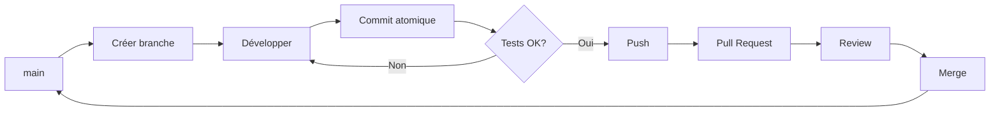

# Guide des Commits Git - Workflow et Catégories

## 🎯 Vue d'ensemble du workflow

Le workflow de commits suit une logique de développement itératif où chaque commit représente une unité de travail complète et testée.



## 📝 Catégories de commits détaillées

### 1. **feat** - Nouvelles fonctionnalités
Utilisé pour tout ajout de nouvelle capacité au code.

**Quand l'utiliser :**
- Ajout d'une nouvelle fonction
- Création d'un nouveau composant
- Implémentation d'une nouvelle API endpoint
- Ajout d'une nouvelle page/vue

**Exemples :**
```bash
feat(auth): implémenter connexion par email
feat(dashboard): ajouter graphique des ventes
feat(api): créer endpoint /products
feat(ui): ajouter composant Modal réutilisable
```

**Workflow typique :**
```bash
# Créer la branche
git checkout -b feature/login-email

# Après développement
git add src/auth/login.js src/auth/login.test.js
git commit -m "feat(auth): implémenter connexion par email

- Ajout validation email
- Gestion erreurs de connexion
- Tests unitaires inclus"
```

### 2. **fix** - Corrections de bugs
Pour toute correction d'un comportement incorrect.

**Quand l'utiliser :**
- Correction d'une erreur
- Résolution d'un crash
- Correction d'un comportement non conforme
- Fix de régression

**Exemples :**
```bash
fix(cart): corriger calcul total avec remise
fix(api): gérer timeout sur requêtes longues
fix(ui): empêcher double-clic sur bouton submit
fix(auth): corriger redirection après déconnexion
```

**Workflow avec référence issue :**
```bash
# Si lié à une issue GitHub
git commit -m "fix(cart): corriger calcul total avec remise

Résout le problème où les remises n'étaient pas
appliquées correctement sur le sous-total.

Fixes #123"
```

### 3. **docs** - Documentation
Modifications qui n'affectent que la documentation.

**Quand l'utiliser :**
- Mise à jour README
- Ajout de commentaires JSDoc
- Documentation API
- Guides d'utilisation

**Exemples :**
```bash
docs(readme): ajouter section installation Docker
docs(api): documenter paramètres endpoint /users
docs(contributing): ajouter guide de contribution
docs: mettre à jour changelog pour v2.0.0
```

### 4. **style** - Formatage et style
Changements qui n'affectent pas la logique du code.

**Quand l'utiliser :**
- Formatage (espaces, indentation)
- Ajout/suppression de points-virgules
- Renommage de variables pour clarté
- Réorganisation imports

**Exemples :**
```bash
style(global): appliquer prettier sur tous les fichiers
style(components): normaliser nommage des props
style: corriger indentation dans utils/
style(css): réorganiser propriétés par ordre alphabétique
```

### 5. **refactor** - Refactorisation
Modification du code sans changer son comportement externe.

**Quand l'utiliser :**
- Amélioration de la structure
- Optimisation performances
- Simplification de code complexe
- Extraction de fonctions

**Exemples :**
```bash
refactor(auth): extraire logique validation dans helpers
refactor(database): optimiser requêtes avec index
refactor(components): convertir class en hooks React
refactor(api): centraliser gestion des erreurs
```

**Workflow refactoring complexe :**
```bash
# Plusieurs commits pour un gros refactoring
git commit -m "refactor(user): extraire UserService - partie 1/3"
git commit -m "refactor(user): migrer controllers - partie 2/3"
git commit -m "refactor(user): nettoyer ancien code - partie 3/3"
```

### 6. **test** - Tests
Ajout ou modification de tests uniquement.

**Quand l'utiliser :**
- Ajout tests unitaires
- Ajout tests d'intégration
- Correction tests cassés
- Amélioration couverture

**Exemples :**
```bash
test(auth): ajouter tests edge cases login
test(api): ajouter tests intégration products
test: augmenter couverture utils à 90%
test(e2e): ajouter scénarios checkout
```

### 7. **chore** - Maintenance
Tâches de maintenance qui ne modifient ni le code source ni les tests.

**Quand l'utiliser :**
- Mise à jour dépendances
- Configuration build
- Scripts npm
- Configuration CI/CD

**Exemples :**
```bash
chore(deps): mettre à jour React vers 18.2.0
chore(build): optimiser bundle webpack
chore(ci): ajouter tests automatiques sur PR
chore: configurer husky pour pre-commit
```

### 8. **perf** - Performance
Modifications spécifiquement pour améliorer les performances.

**Quand l'utiliser :**
- Optimisation algorithmes
- Réduction consommation mémoire
- Amélioration temps de chargement
- Cache implementation

**Exemples :**
```bash
perf(api): implémenter cache Redis pour /products
perf(images): ajouter lazy loading
perf(db): optimiser requête dashboard (500ms -> 50ms)
perf(render): mémoïser composants lourds
```

## 🔄 Workflow complet par type de tâche

### Développement d'une nouvelle fonctionnalité

```bash
# 1. Créer branche depuis main à jour
git checkout main
git pull origin main
git checkout -b feature/user-profile

# 2. Développement avec commits progressifs
git add src/components/UserProfile.jsx
git commit -m "feat(profile): créer composant UserProfile de base"

git add src/api/userProfile.js
git commit -m "feat(profile): ajouter appels API profil utilisateur"

git add src/components/UserProfile.test.jsx
git commit -m "test(profile): ajouter tests UserProfile"

git add src/styles/userProfile.css
git commit -m "style(profile): ajouter styles responsive"

# 3. Push et Pull Request
git push origin feature/user-profile
```

### Correction d'un bug urgent

```bash
# 1. Créer branche hotfix depuis main
git checkout main
git checkout -b fix/critical-payment-error

# 2. Corriger et tester
# ... modifications ...
git add src/payment/processor.js
git commit -m "fix(payment): corriger division par zéro sur remise 100%

Le calcul du prix final plantait quand la remise
atteignait 100%. Ajout vérification avant division.

Fixes #456"

# 3. Push rapide pour review
git push origin fix/critical-payment-error
```

### Refactoring progressif

```bash
# Sur une branche dédiée
git checkout -b refactor/modernize-auth

# Étape 1: Préparation
git commit -m "refactor(auth): créer nouvelle structure de fichiers"

# Étape 2: Migration
git commit -m "refactor(auth): migrer logique vers AuthService"

# Étape 3: Tests
git commit -m "test(auth): adapter tests au nouveau AuthService"

# Étape 4: Nettoyage
git commit -m "refactor(auth): supprimer ancien code deprecated"

# Étape 5: Documentation
git commit -m "docs(auth): documenter nouvelle architecture"
```

## 💡 Conseils pratiques

### Commits atomiques
Un commit doit représenter UN changement logique complet :
- ✅ `feat(cart): ajouter bouton suppression article`
- ❌ `feat(cart): ajouter bouton suppression et fix bug total et update CSS`

### Utiliser le corps du message
Pour les changements complexes, utilisez le corps du message :
```bash
git commit -m "refactor(database): migrer vers PostgreSQL

- Remplacer MySQL par PostgreSQL
- Adapter toutes les requêtes natives
- Mettre à jour configuration Docker
- Migrer données existantes

Breaking change: nécessite PostgreSQL 14+"
```

### Conventions supplémentaires

**Breaking changes** : Indiquez les changements cassants
```bash
feat(api)!: modifier format réponse /users

BREAKING CHANGE: la réponse est maintenant paginée
```

**Scopes multiples** : Utilisez une virgule
```bash
fix(auth,session): corriger gestion timeout
```

**Pas de scope** : Pour les changements globaux
```bash
chore: mettre à jour toutes les dépendances
```

## 📊 Résumé des bonnes pratiques

1. **Un commit = Un objectif** : Chaque commit doit avoir un but unique et clair
2. **Commits fréquents** : Committez dès qu'une unité logique est complète
3. **Messages descriptifs** : Le message doit expliquer le "pourquoi", pas juste le "quoi"
4. **Tests inclus** : Si possible, incluez les tests dans le même commit que la fonctionnalité
5. **Review avant push** : Toujours faire `git diff --staged` avant de committer
6. **Historique propre** : Utilisez `git rebase -i` pour nettoyer l'historique avant la PR

## 🚀 Commandes Git utiles

```bash
# Voir les modifications non commitées
git status
git diff

# Committer par morceaux interactifs
git add -p

# Modifier le dernier commit
git commit --amend

# Voir l'historique avec graph
git log --oneline --graph --all

# Chercher dans l'historique
git log --grep="fix.*auth"

# Annuler modifications non commitées
git checkout -- fichier.js

# Réorganiser les commits avant push
git rebase -i HEAD~3
```